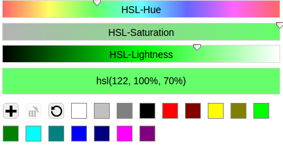
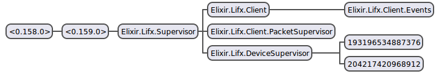

# Lifx

**A Client for Lifx LAN API**

Automatically discover and control all of your [Lifx](http://lifx.com) lightbulbs.

## Use

    1. git clone https://github.com/NationalAssociationOfRealtors/lifx.git
    2. mix do deps.get, deps.compile
    3. iex -S mix

For testing purposes it includes a small web frontend that's available at [http://localhost:8800](http://localhost:8800)

The web interface currently controls all lights on the network.

You can disable the web interface by setting `:lifx, tcp_server: false` in your applications config file

## Explanation

As long as you are on the same subnet as your lightbulbs, you should see some information in stdout about devices being discovered

    Starting Device
    %Lifx.Device.State{
        group: %Lifx.Protocol.Group{
            id: [],
            label: nil,
            updated_at: 0
        },
        host: {192, 168, 1, 118},
        hsbk: %Lifx.Protocol.HSBK{
            brightness: 100,
            hue: 120,
            kelvin: 4000,
            saturation: 100
        },
        id: :"193196534887376",
        label: nil,
        location: %Lifx.Protocol.Location{
            id: [],
            label: nil,
            updated_at: 0
        },
        port: 56700,
        power: 0,
        rx: 0,
        signal: 0,
        tx: 0
    }

What's shown here is the initial state of the bulb. Shortly after the bulb is discovered it will gather the state information, and update it every 5 seconds.

## Architecture

`Lifx.Client` is a small UDP server running on a randomly selected available port. It is the main interface for sending and receiving messages. As a new device is discovered a process is spawned and it's state represents the given device.

Every 5 seconds the device process queries itself for updated state information. The updated state is then broadcast (using notify) over `Lifx.Client.Events` event bus. Anyone can add a handler to the event bus to handle updated device state by calling `Lifx.Client.add_handler`. See `Lifx.Handler` for an example implementation of an event handler.

`Lifx.Client` also provides a function to set bulb color to all devices currently on the network. It uses a broadcast packet to accomplish this.

`Lifx.Protocol` handles all protocol related functions, parsing and creating packets as well as payloads.

In order to communicate with a single bulb, in a network that may contain multiple devices you would use the `Lifx.Device` interface `Lifx.Device.set_color(pid, %Lifx.Protocol.HSBK{}, duration)` where pid is `Lifx.Device.State.id`
